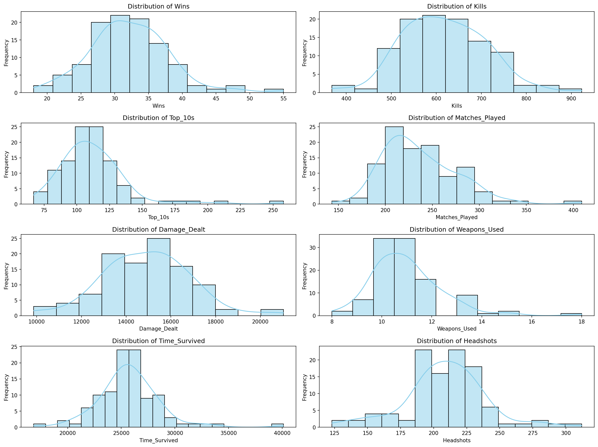
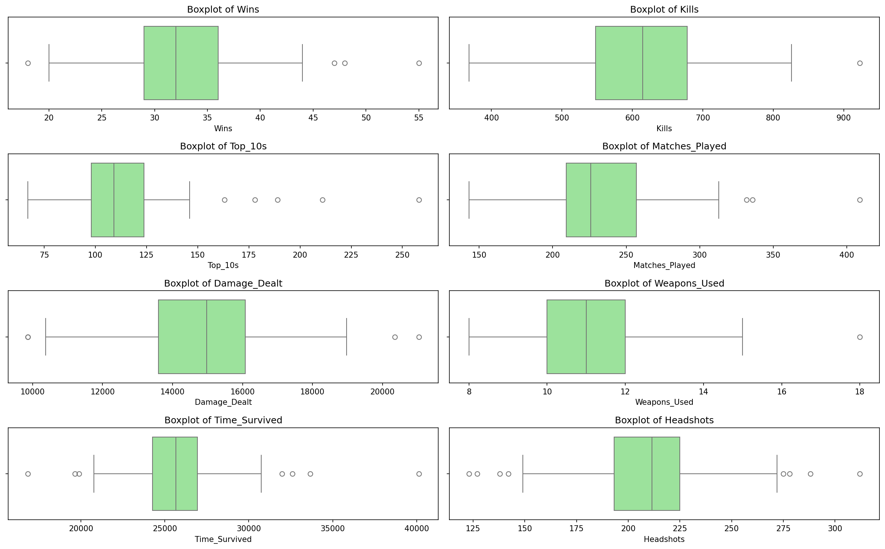
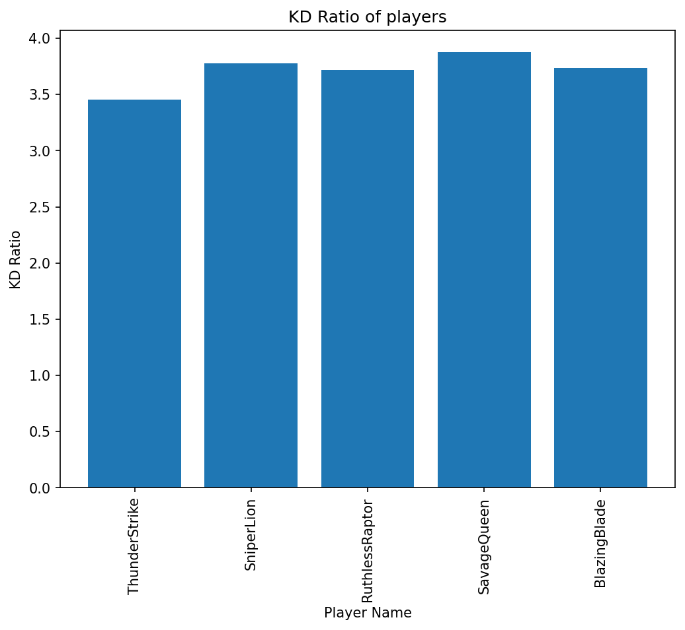
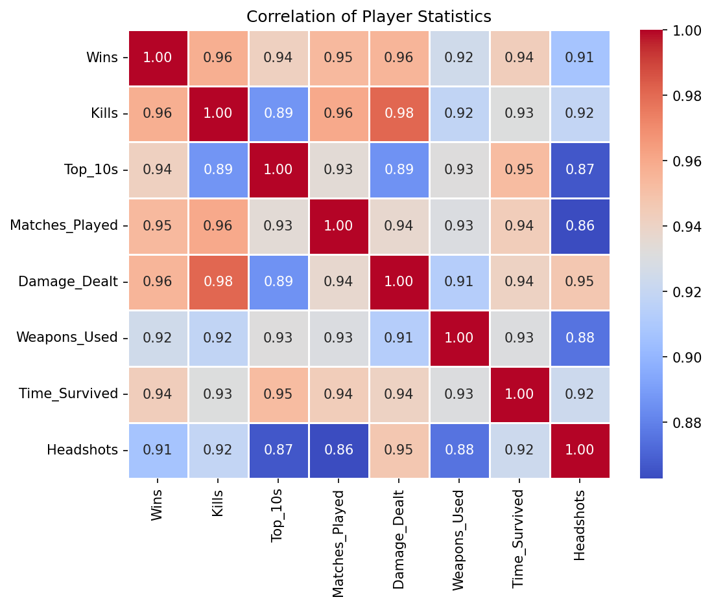

# BGMI Stats Analysis

This repository contains a Jupyter Notebook (`BGMI_stats (1).ipynb`) and a CSV file of player statistics (`Pubg_Stats.csv`). The notebook performs exploratory data analysis, transformations, and visualizations of player performance metrics.

What's included
- `BGMI_stats (1).ipynb` - Notebook with data loading, cleaning, feature engineering, transformations (Yeo-Johnson), and many visualizations.
- `Pubg_Stats.csv` - Raw data used by the notebook.

How to run
1. Create and activate a Python virtual environment (optional but recommended):

   # Windows PowerShell
   python -m venv myvenv; .\myvenv\Scripts\Activate.ps1

2. Install dependencies listed in `requirments.txt` (note: file name uses a single 'e'):

   pip install -r requirments.txt

3. Launch Jupyter Notebook from the repository root and open `BGMI_stats (1).ipynb`:

   jupyter notebook

Notes and tips
- The notebook uses `pandas`, `numpy`, `matplotlib`, `seaborn`, and `scikit-learn` for preprocessing and plotting.
- If plots don't render inline, ensure the notebook has the `%matplotlib inline` magic at the top or enable inline plotting in your Jupyter environment.

Contact
- If you need additional plots or data cleaning steps, edit the notebook and re-run cells.

Plots
-----

The notebook can save plot images into a `plots/` folder when you run the final cell in the notebook. After running that cell the README will show the images below (if the images exist):

